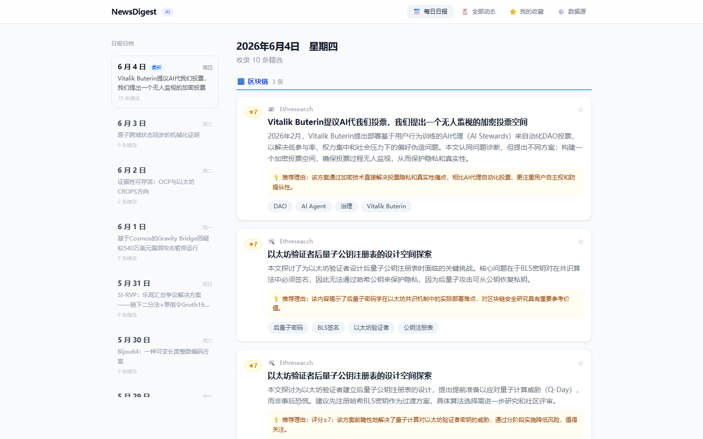
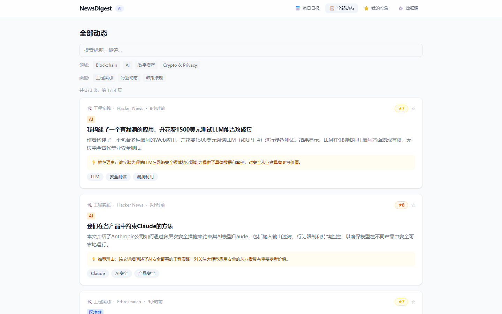
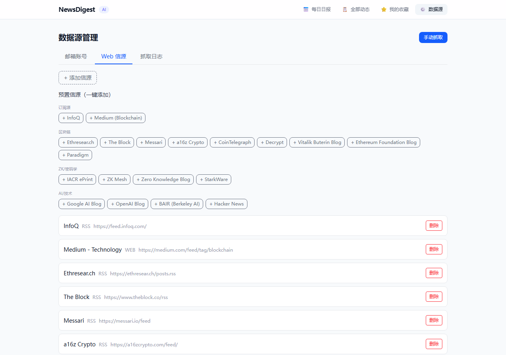

# 📰 NewsDigest

> 🤖 AI 替你读新闻 — 自动抓取 · 智能分类 · 每日精选日报

每天醒来，AI 已经帮你挑好了最值得读的 10 条技术新闻。不再被几百封邮件和几十个 RSS 源淹没。

<p align="center">
  <a href="https://github.com/Calora/news-aggregator/stargazers"></a>
  
  
  
  
</p>

---

## ✨ 为什么你需要这个

你订阅了十几个新闻源，邮箱里塞满了 newsletter。每天光是扫标题就要花半小时，更不用说判断哪篇值得细读。

NewsDigest 帮你做三件事：

1. 📥 **自动收** — RSS + 网页 + 邮件三通道抓取，你不用再打开任何邮箱和阅读器
2. 🧠 **帮你读** — DeepSeek 大模型自动翻译英文、分类打标签、评分过滤噪音
3. 📋 **挑重点** — 每天早上 8 点，一份 ≤10 条精选的日报已经整装待发

---

## 🪄 看一眼长什么样

### 📅 每日日报

左侧日期归档，每天 4 个领域分组，带评分 + 推荐理由 + 标签，早 8 点自动生成。

<p align="center">
  
</p>

### 📋 全部动态

多维度筛选，卡片式浏览，7 分以下自动过滤噪音。按领域、类型、标签自由组合。

<p align="center">
  
</p>

### ⚙️ 数据源管理

预置信源一键添加，输入 URL 即可测试连通性。支持 RSS + 网页两种抓取模式。

<p align="center">
  
</p>

---

## 🛠 技术栈

```
📡 数据采集 ────→ 🧠 AI 处理 ────→ 🖥 展示层
  RSS            DeepSeek API       React + TypeScript
  Gmail API       · 三维分类        Tailwind CSS
  IMAP 邮箱       · 智能评分        Vite
  网页抓取        · 中英翻译
       ↓                ↓                ↓
    FastAPI  ─────→  SQLite  ←─────  REST API
```

---

## 🚀 3 分钟跑起来

### 你需要准备

- 🐍 Python 3.10+
- 🟢 Node.js 18+
- 🔑 DeepSeek API Key → [免费注册获取](https://platform.deepseek.com) 只需 10 块钱能用一个月

### 方式一：AI Agent 一键安装 🤖

项目内置了多平台 Skill 定义，AI 会自动完成克隆、依赖、配置和启动。

| 平台 | 安装方式 |
|------|---------|
| **Claude Code** | 说：`帮我安装这个 skill：https://github.com/Calora/news-aggregator` |
| **Cursor** | 项目 `.cursorrules` 已就绪，打开后说：`帮我安装 NewsDigest` |
| **GitHub Copilot / Codex** | 项目 `.github/copilot-instructions.md` 已就绪，说：`install NewsDigest` |

### 方式二：手动克隆安装

```bash
# 克隆
git clone https://github.com/Calora/news-aggregator.git
cd news-aggregator

# 装依赖
pip install -r backend/requirements.txt
cd frontend && npm install && cd ..

# 配置
cp backend/.env.example backend/.env
# 编辑 backend/.env，填一行：DEEPSEEK_API_KEY=sk-你的key
```

### 启动

```bash
# Windows 一键
start.bat

# macOS / Linux
cd backend && python -m uvicorn app.main:app --host 0.0.0.0 --port 8000 &
cd frontend && npm run dev -- --host 0.0.0.0
```

打开 `http://localhost:5173`，第一次运行会自动批量抓取所有信源。

---

## 📦 项目结构

```
news-aggregator/
├── ⚡ start.bat              # Windows 一键启动
├── 🩺 health_check.py        # 自巡检脚本，每天4次
├── 🧠 skills/                # Claude Code Skill 定义
├── .cursorrules              # Cursor IDE 指令
├── .github/                  # GitHub Copilot / Codex 指令
├── docs/                     # 截图 & 文档
├── 🔧 backend/               # Python FastAPI
│   ├── .env.example          # 配置模板
│   ├── requirements.txt      # Python 依赖
│   ├── scheduler.py          # 定时任务
│   └── app/
│       ├── main.py           # 🚪 入口
│       ├── models.py         # 📊 5 张数据表
│       ├── routers/          # 🔀 API 路由
│       └── services/
│           ├── web_fetcher.py     # 🌐 RSS + 网页抓取
│           ├── email_fetcher.py   # ✉️ IMAP 邮件
│           ├── gmail_fetcher.py   # 📨 Gmail API
│           ├── classifier.py      # 🤖 AI 分类 + 评分 + 翻译
│           ├── deduplicator.py    # 🧹 去重
│           └── pipeline.py        # ⛓ 完整流水线
└── 🎨 frontend/              # React + Tailwind + Vite
    └── src/
        ├── pages/            # 📄 4 个页面
        ├── components/       # 🧩 UI 组件
        └── api/              # 🔌 API 客户端
```

---

## 📡 预置信源（20 个）

系统启动时自动加载，涵盖区块链、密码学、AI 三大方向。

**🔗 区块链**
[Ethresear.ch](https://ethresear.ch/posts.rss) ·
[The Block](https://www.theblock.co/rss) ·
[Messari](https://messari.io/feed) ·
[a16z Crypto](https://a16zcrypto.com/feed/) ·
[CoinTelegraph](https://cointelegraph.com/rss) ·
[Decrypt](https://decrypt.co/feed) ·
[Ethereum Foundation Blog](https://blog.ethereum.org/feed.xml) ·
[Vitalik Buterin Blog](https://vitalik.eth.limo/feed.xml) ·
[Paradigm](https://www.paradigm.xyz/feed)

**🔐 密码学 / ZK**
[IACR ePrint](https://eprint.iacr.org/rss) ·
[ZK Mesh](https://zkmesh.substack.com/feed) ·
[Zero Knowledge Blog](https://zeroknowledge.fm/feed) ·
[StarkWare](https://starkware.co/feed/)

**🤖 AI / 技术**
[Hacker News](https://hnrss.org/frontpage) ·
[InfoQ](https://feed.infoq.com/) ·
[Google AI Blog](https://blog.research.google/feeds/posts/default) ·
[OpenAI Blog](https://openai.com/blog/rss.xml) ·
[BAIR (Berkeley AI)](https://bair.berkeley.edu/blog/feed.xml) ·
[Medium (Blockchain)](https://medium.com/feed/tag/blockchain)

> 在前端「数据源管理 → Web 信源 → 预置信源」中一键添加，也可手动填入任意 RSS / 网页 URL。

---

## 🎯 自定义关注领域

系统默认围绕 **区块链 / AI / 密码学与隐私计算 / 数字资产** 四个领域做分类和过滤。如果你关注的方向不同，可以自行修改，**不需要改后端架构**。

### 涉及的文件（3 处）

| 文件 | 改什么 |
|------|--------|
| `backend/app/services/classifier.py` | 修改 `CLASSIFY_PROMPT` 中的领域定义、排除规则、判断原则 |
| `frontend/src/types.ts` | 修改 `Domain` 类型定义，与后端保持一致 |
| `frontend/src/components/FilterBar.tsx` | 修改领域筛选按钮的显示文字和顺序 |

### 示例：改为关注"生物医药 + AI"

**1. 修改分类器 Prompt**（`classifier.py` 第 15-49 行）

```python
# 将原来的 Blockchain / AI / 数字资产 / Crypto & Privacy
# 替换为你的领域：
- 生物医药: 药物发现/蛋白质预测/基因组学/临床试验AI
- 大模型: LLM/Agent/训练推理/AI基础设施
- 医疗器械: 影像诊断/手术机器人/可穿戴设备
```

**2. 修改前端类型**（`types.ts`）

```typescript
export type Domain = '生物医药' | '大模型' | '医疗器械'
```

**3. 修改筛选栏**（`FilterBar.tsx`）

```typescript
const domains: Domain[] = ['生物医药', '大模型', '医疗器械']
```

重启后端后，后续抓取的文章会按新领域分类。已有文章可以点「手动抓取」触发重新分类。

---

## 🔌 可选：接入私人邮箱

如果你有 Medium、InfoQ 等邮件订阅，可以接入 Gmail 自动将邮件中的文章链接纳入新闻流。

> ⚠️ **QQ 和 163 邮箱不推荐直接接入** — 国内邮箱的 IMAP 存在安全策略限制，即使开启授权码也可能被服务器拒绝访问。
> 
> 💡 **替代方案**：在 163 / QQ 邮箱设置中将邮件**自动转发到 Gmail**，再通过 Gmail API 接入系统，完美绕过限制。

**📨 Gmail API 接入步骤：**

1. 在 [Google Cloud Console](https://console.cloud.google.com/apis/credentials) 创建 OAuth 桌面客户端，下载 `credentials.json` 放到 `backend/`
2. 运行 `python backend/setup_gmail_oauth.py`，浏览器授权
3. 在 `.env` 中配置 `GMAIL_CLIENT_ID`、`GMAIL_CLIENT_SECRET`、`GMAIL_REFRESH_TOKEN`
4. 如需国内访问，配置 `HTTP_PROXY=http://127.0.0.1:你的代理端口`
5. ⚠️ Google Cloud 项目需发布为"生产模式"，否则 Token 7 天过期

让 163/QQ 邮箱自动转发到 Gmail，即可实现全链路自动抓取。

---

## 💬 FAQ

<details>
<summary>日报为啥是空的？</summary>

去「数据源管理 → 手动抓取」点一下，等 10-30 秒。如果还是空，检查 DeepSeek Key 是否有效。
</details>

<details>
<summary>为什么文章全是英文？</summary>

DeepSeek API Key 没配或失效。系统依赖 AI 做翻译和中文摘要。
</details>

<details>
<summary>想和同事一起看？</summary>

前端启动在 `0.0.0.0:5173`，局域网任何设备访问 `http://<你的IP>:5173` 即可。
</details>

<details>
<summary>邮件拉取报错？</summary>

Gmail API 需要 OAuth 授权，跑 `python backend/setup_gmail_oauth.py` 完成。QQ/163 需要去邮箱设置里生成授权码（不是登录密码）。
</details>

---

## ⭐ 如果对你有用

如果这个项目帮你省下了每天刷新闻的时间，欢迎 [Star](https://github.com/Calora/news-aggregator) ⭐ 支持一下。你的 Star 是我持续更新的动力，也欢迎提 Issue 和 PR。

---

## 📄 License

Copyright © 2026 [Calora Sia](https://github.com/Calora) · Apache License 2.0

---

<p align="center">
  <sub>Built with ❤️ + 🧠 + ⛓️</sub>
</p>
